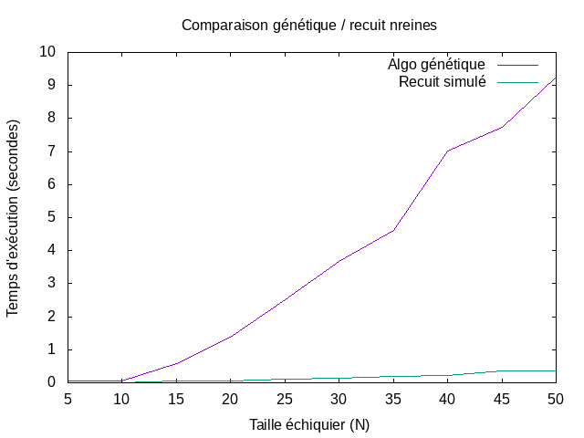

# Rapport TP IA Algorithmes génétiques
> Mattéo AUGER

## Préambule

### Compiler le programme
Le programme a été codé en `golang`, vous trouverez dans le dossier `bin` un fichier déjà compilé. Cependant, pour recompiler le programme vous povez utiliser la commande `make genetic_queens`.

### Exétuer le programme
L'exécution du programme se fait selon deux modes.

Le premier mode exécute l'algorithme avec les paramètres données : 
```bash
./bin/genetic_queens.x 
<taille de l échiquier> 
<taille de la population> 
<chances de mutation> 
<pourcentage des meilleurs individus à garder> 
<pourcentage des pires individus à garder> 
<pourcentage des enfants à garder>
```
Pour exécuter l'algorithme pour un échiquier de 50 cases :
```bash
./bin/genetic_queens.x 50 10000 0.05 0.15 0.05 0.8
```

Le second mode permet d'effectuer un benchmark de l'algorithme génétique de 10x10 à 70x70 cases.
Le résultat sera écrit dans le fichier "donnees.txt".
Pour exécuter le benchmark : `./bin/genetic_queens.x benchmark`

## Analyse des résultats

### Résultat benchmark algorithme génétique vs recuit simulé



On observe ici que le temps d'exécution monte de plus en plus jusqu'à 20 secondes pour un échiquier de taille 50x50 pour l'algorithme génétique, alors que le recuit simulé trouve cette solution en à peine 35ms.
Cette marge de performances est due au fait que l'algorithme génétique est peu adapté au problème des n-reines à cause de la définition d'un gène et de l'opération de croisement entre deux individus. L'algorithme nécessite beaucoup de générations et stagne facilement ce qui engendre un temps d'exécution relativement long. Le recuit simulé en revanche permet de sortir rapidement de ces "stagnations" afin de mieux cibler l'optimum.
